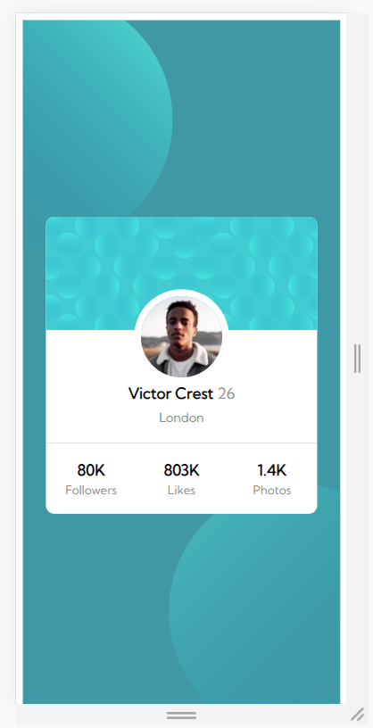

# Make It Real - Profile Card Component

This is a solution to the third project of the Make It Real course.

## Table of contents

- [Overview](#overview)
  - [The challenge](#the-challenge)
  - [Screenshot](#screenshot)
- [My process](#my-process)
  - [Built with](#built-with)
  - [What I learned](#what-i-learned)
  - [Continued development](#continued-development)
  - [Useful resources](#useful-resources)
- [Author](#author)
- [Acknowledgments](#acknowledgments)

## Overview

### The challenge

Users should be able to:

- Design a user profile card as close as the screenshot picture of the project.

### Screenshot




## My process

### Built with

- CSS custom properties
- Flexbox
- Position property for layout overlaping
- Media Queries (Breakpoint 500px, 800px)
- Semantic HTML5

### What I learned

We learned how to use properties such as Position (realitve/absolute) for overlaping images.
```css
#backgroundTopCircle{
    position: absolute;
    z-index: 2;
    left: -18%;
    top: -67%;
}
```
We learned how to use Media Queries for responsive design and Flexbox for layout distribution.
```css
@media (max-width:500px){
    #backgroundTopCircle{
        width: 300px;
        height: 300px;
        left: -33%;
        top: -4%;
    }
}
```

We learned how to import google Font-families and apply those writing styles.
```css
@import url('https://fonts.googleapis.com/css?family=Kumbh Sans');
p{
    font-size: 18px;
    font-weight: 400;
    font-family: 'Kumbh Sans';
}
```

We learned how to customize the webpage Fav Icon and the window title.

```html
<link
      rel="icon"
      href="./Assets/favicon-32x32.png"
      type="image/png"
      sizes="32x32"
    />
```

### Continued development

It will be nice to use Grid to create the same layout.

### Useful resources

- [Flexbox tutorial](https://www.youtube.com/watch?v=tXIhdp5R7sc) - This helped me figuring out how to use Flexbox properties.
- [Media queries](https://youtu.be/sd16e11blHI) - This is an amazing tutorial for media queries basic concepts.
- [Position property](https://youtu.be/IfMYDsorYXw) - This is an amazing tutorial for position property basic concepts.

## Author

- Github - [Juan Velasco](https://github.com/juandiegovelsol)
- Github - [Ivan Cabulo](https://github.com/icabulo)

## Acknowledgments

Kudos to our friends and mentors: Sergio Jaramilo and Daniel Espitia.
